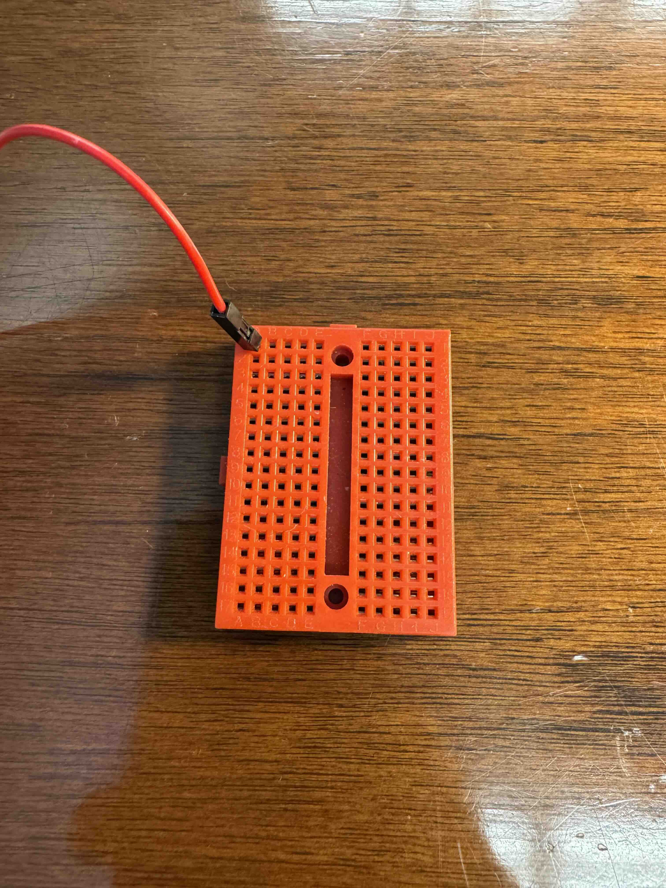
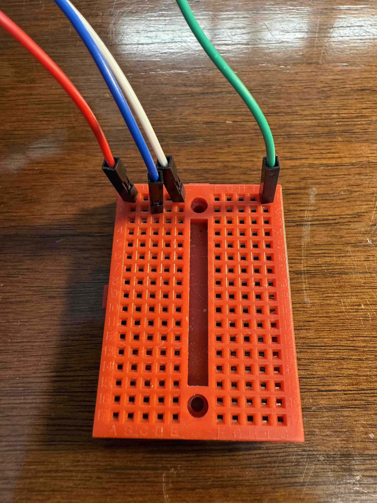
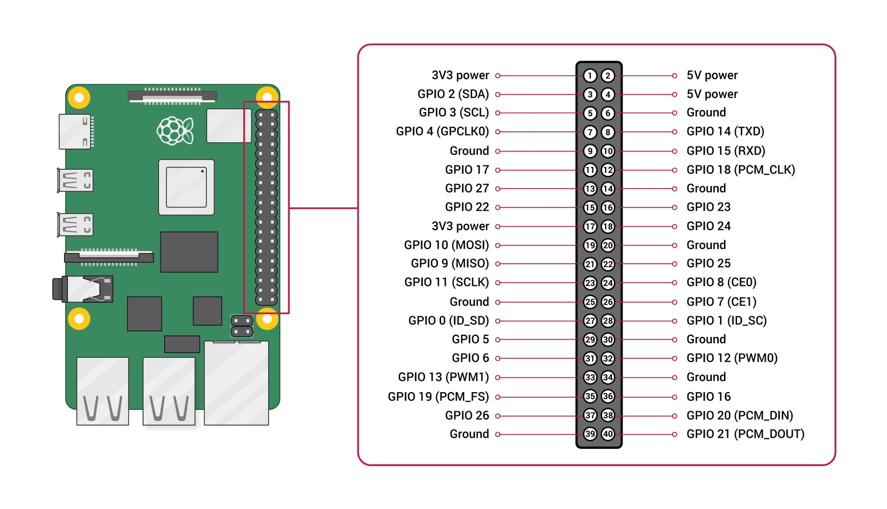
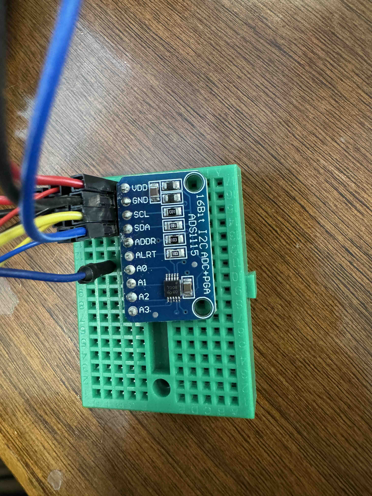

# Adding An Analog Sensor

Unless you are using higher end, more expensive lab-grade sensors like what we have installed in our aquaculture lab and on *Wonder*, the water conductivity sensor, water temperature sensor, and turbidity sensor you are using are analog sensors. The Raspberry Pi does not have an analog GPIO pin, so we need to use a converter. 

Included in the Ocean Pi Kit is a small breadboard that you can use to connect the Analog Digital Converter (ADC). For the BME280 sensor, you connected it directly to the GPIO pins of the Raspberry Pi. Since we need to attach multiple sensors to the SDA and SCL GPIO pins, we need to use the breadboard to split and share those pins. So unplug your BME280 sensor and attach the ADC via the breadboard in the same way you attached the BME280 sensor. 

A little background on breadboards. A breadboard is a series of "rails" or bus bars that join wires into a common circuit. On these small breadboards, the horizontal rows with 5 holes are all connected. So if you send 3.3 volts from the Raspberry Pi to one of those holes, the other 4 holes will also have 3.3 volts. In the photo below, I have electrified the top left row with 3.3 volts.



Larger breadboards have dedicated rails for power that are labeled as such, but we can use any rail we like for power. The central divider is a break between the left and right side of the board. As an example, in the below photo, the red wire is sending 3.3 volts from the Raspberry Pi. The green wire receives no power because it is on the other side of the central divider. The blue wire also receives no power because it is on a different row. Only the white wire receives 3.3 volts.



Before you start adding wires, press the ADC into the board and then bring wires to the board and into the appropriate slots. VDD = 3.3 volts, GND = ground, SDA = GPIO 2, and SCL = GPIO 3. Below is a photo of my ADC. Bear in mind, it has some extra wires coming out of it, which you can also do when you add your BME280 sensor back onto the Raspberry Pi. Instead of putting the BME280 sensor back onto the GPIO pins, you are going to put them into the breadboard and share the power, ground, SDA, and SCL rails with the ADC.




Before you actually attach a sensor to your ADC, let's make sure your Raspberry Pi sees your ADC via I2C. Run `sudo i2cdetect -y 1` again. If you have your BME280 sensor and your ADC wired up correctly, the result of that command should be:

```bash
(venv-ocean-pi) planetschool@raspberrypi:~ $ sudo i2cdetect -y 1
     0  1  2  3  4  5  6  7  8  9  a  b  c  d  e  f
00:                         -- -- -- -- -- -- -- -- 
10: -- -- -- -- -- -- -- -- -- -- -- -- -- -- -- -- 
20: -- -- -- -- -- -- -- -- -- -- -- -- -- -- -- -- 
30: -- -- -- -- -- -- -- -- -- -- -- -- -- -- -- -- 
40: -- -- -- -- -- -- -- -- 48 -- -- -- -- -- -- -- 
50: -- -- -- -- -- -- -- -- -- -- -- -- -- -- -- -- 
60: -- -- -- -- -- -- -- -- -- -- -- -- -- -- -- -- 
70: -- -- -- -- -- -- -- 77         
```
Since we know from earlier that BME280 is at the 0x77 address, the ADC must be at 0x48. So we can add that to our code along with the libraries needed for the ADC. Add the following two lines of code to their proper places, `## Import Libraries` and `## Declare Variables`.

```python
from adafruit_ads1x15 import ADS1115, AnalogIn, ads1x15
adc_address = 0x48	
adc = ADS1115(i2c, address=int(adc_address))
turbidity_sensor = AnalogIn(ads_dfrobot, ads1x15.Pin.A1)
```

## Adding the Analog Sensor
Now we can add the sensor. Your analog sensor will have a positive wire, negative wire, and data wire. The positive wire and negative wire will share the 3.3 volt and ground bars on the breadboard, respectively. The data wire will go to any one of the four analog ports on the ADC: A0, A1, A2, or A3. Whichever one you pick, just be sure that it matches the `AnalogIn` for the sensor variable you created. In the code above, we created a variable called `turbidity_sensor` and put it on `A1`.

```python
data["turbidity_value"] = turbidity_sensor.value
data["turbidity_volts"] = turbidity_sensor.volts
```

The voltage and value from your sensor will change based on what your sensor is sensing. In other words, we need to interpret it. We need to read the sensor documentation to know what temperature 