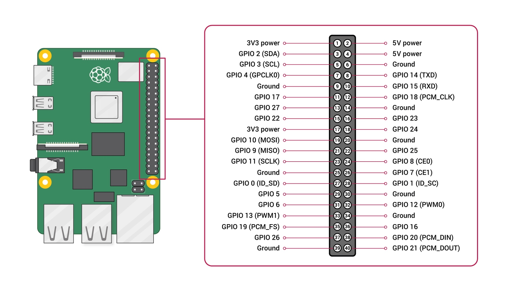

# Getting Your First Sensor Working

We will use two types of sensors in this project: analog and digital. For a discussion of the differences between these two types of sensors, have a look at [this article by Atlas Scientific](https://atlas-scientific.com/blog/analog-vs-digital-sensors-understanding-the-key-differences/). We will use an Analog-to-Digital Converter (ADC) to turn analog sensor output into a digital value that we can manipulate with our code. The digital sensor outputs already show up as digital values that we can work with, so we will start there.

The data protocol we will be using is called Inter-Integrated Circuit, commonly referred to by its shorthand “I2C” or “i2c.” Using this protocol requires four wires running from the Raspberry Pi to the sensor:

1. Power, usually 5 volts
2. Ground
3. SCL, which stands for “Serial Clock”
4. SDA, which stands for “Serial Data”

The benefit of I2C is that we can connect a bunch of sensors to a single data pin on the Raspberry Pi GPIO board. When you think about how data is sent over a wire—a series of electrical signals—it actually seems impossible that data from more than one sensor could be transmitted simultaneously to the same pin. That is why we need the Serial Clock wire: it tells the Raspberry Pi when the data for the particular sensor is coming in via the Serial Data stream. 

## Connect Your Sensor

Your sensor will have a Qwiic connector that you can plug your Qwiic wire into. 

**Note:** While the Raspberry Pi 5 has what looks like a Qwiic port below the GPIO pins, this cannot be used for I2C as this port’s pins do not utilize the wires for the same purpose as I2C. This port is specifically designed for a fan.

Coming out of the other end from your Qwiic connector will be four different colored wires. The colors correspond to the following:

Blue: SDA

Yellow: SCL

Black: Ground

Red: 3.3V

Make sure your Raspberry Pi is powered off for connecting or disconnecting powered components. In the photo below I am using a GPIO extender, but you can connect your wires directly to the GPIO pins on the Pi. Using a pin diagram, find the SCL and SDA pins on the Raspberry Pi. It is good practice in electronics to always connect the ground wire last.



Once your wires are connected, you can turn on your Raspberry Pi. You should see a green light illuminate on your sensor.

## Talk to Your Sensor

Now that our sensor is plugged in, how do we talk to it? How do we know what commands to use? When you turn on a video game for the first time, at least you are holding a controller with buttons and a joystick—you are given a “language” (albeit a physical one) for communicating with the software. We are flying blind with this strange new hardware…right?

No, we have a way! It is using the library of code that the sensor makers published with the sensor. We can search for this library online using the name of the sensor. I am connecting the BME280 sensor, which senses atmospheric pressure, temperature, and humidity, and it is made by Adafruit. Typing that into Google, I eventually end up [here](https://github.com/adafruit/Adafruit_Python_BME280). Libraries are typically published on Github just like this. But wait, this library is deprecated. Heading over to CircuitPython and searching for anything called “Documentation,” I eventually found my way to [this page](https://docs.circuitpython.org/projects/bme280/en/latest/index.html#). This format of documentation has become the standard for most software projects and was created by an organization called [Read the Docs](https://about.readthedocs.com/). Here we can find examples of how to talk to the sensor and pull data from it. If you want to integrate your own custom sensors into your buoy, this is how you would proceed. But back to our BME280 sensor.

Let’s begin with finding the I2C address of our sensor. Make sure your virtual environment is active and run `sudo i2cdetect -y 1` . You will see a grid of empty slots, which shows you how many I2C devices your Raspberry Pi can handle.

```bash
(venv-ocean-pi) planetschool@raspberrypi:~ $ sudo i2cdetect -y 1
     0  1  2  3  4  5  6  7  8  9  a  b  c  d  e  f
00:                         -- -- -- -- -- -- -- -- 
10: -- -- -- -- -- -- -- -- -- -- -- -- -- -- -- -- 
20: -- -- -- -- -- -- -- -- -- -- -- -- -- -- -- -- 
30: -- -- -- -- -- -- -- -- -- -- -- -- -- -- -- -- 
40: -- -- -- -- -- -- -- -- -- -- -- -- -- -- -- -- 
50: -- -- -- -- -- -- -- -- -- -- -- -- -- -- -- -- 
60: -- -- -- -- -- -- -- -- -- -- -- -- -- -- -- -- 
70: -- -- -- -- -- -- -- 77         
```

Here we see that the address of my sensor is 77, but this is a hexadecimal number. Hexadecimal numbers are useful in coding because of how computers count using 0’s and 1’s. They are useful in this situation because we can count higher with two digits. In decimal, the highest we can count with two digits is 100 (starting with 00 and ending with 99). Hexadecimal uses 0-9 and then a-f as digits, meaning it has 16 characters.  16² = 256, so we can count to 256 using just two digits of hexadecimal. In the decimal system, the left digit corresponds to 10. In hexadecimal, the left digit corresponds to 16, so multiply that digit by 16, then add the right digit. For the letters, just keep counting past 9 once you get to “a” (i.e. a = 10, b = 11, c = 12 and so on). The hexadecimal 77 actually equates to 119 in our more familiar decimal number system.

We write hexadecimal numbers in the following way: 0x77. This format tells us that we are dealing with the hexadecimal 77 not the decimal number 77. Knowing this, we can look back at the table in terminal and understand that the columns are the left digit (they only go up to 7) and the rows are the right digit (up to 16 or “f”). It appears there are 112 available slots—fewer than the full 256 number of possible addresses available. Fortunately, we are not going to be connecting more than 112 sensors!

Now for some basic code to get your sensor to sense something and print it.

```python
## Import Libraries
import board
from adafruit_bme280 import basic as adafruit_bme280

## Declare Variables
i2c_port = 1  #This is a Raspberry Pi setting
bme280_address = 0x77  #The address of our sensor
i2c = board.I2C()  #Accessing the I2C library
bme280 = adafruit_bme280.Adafruit_BME280_I2C(i2c, int(bme280_address)) #Accessing the BME280 library
humidity = bme280.humidity  #Get humidity from the sensor

## The Code!
print(humidity)
```

I saved this code as [buoy.py](http://buoy.py) and then ran it.

If you get the error `ModuleNotFoundError: No module named 'board'` then you are not running your code inside your virtual environment. Be sure to run the code manually in terminal by running `python3 buoy.py`

If you get the error `ModuleNotFoundError: No module named 'adafruit_bme280'` then you are on the right track—we did not install the library for this sensor! Let’s do that. Run `pip3 install adafruit-circuitpython-bme280` . Now try running your program again. You should get the following result:

```python
(venv-ocean-pi) **planetschool@raspberrypi:~ $** python3 buoy.py 
37.672948011873814

```

**🎉 You Did It!**

Time to move onto [Step 3](https://www.notion.so/2aa729464eca80ea97d5cf68ee341b51?pvs=21)

## Questions After This Stage