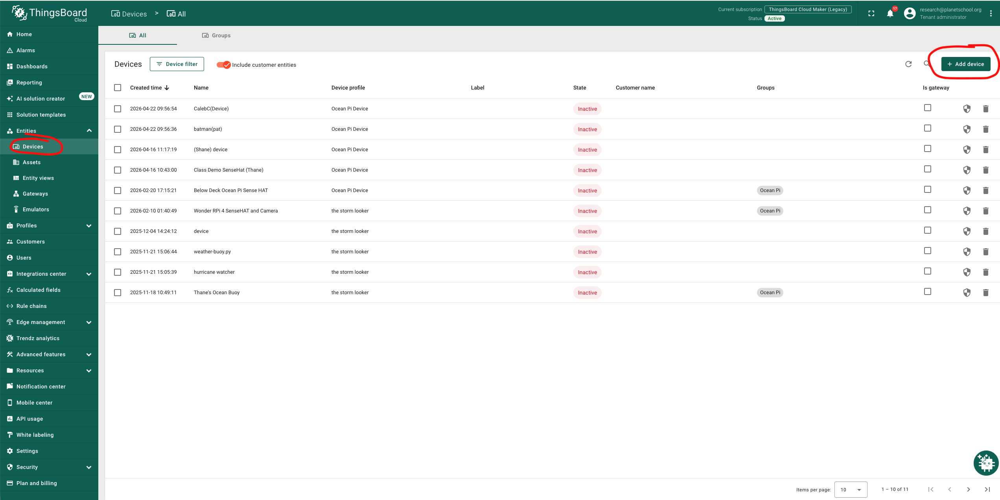
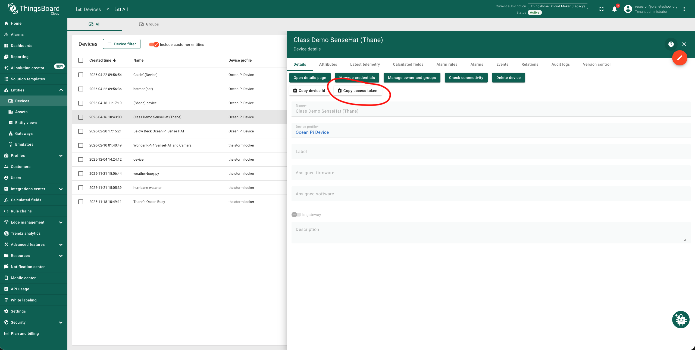
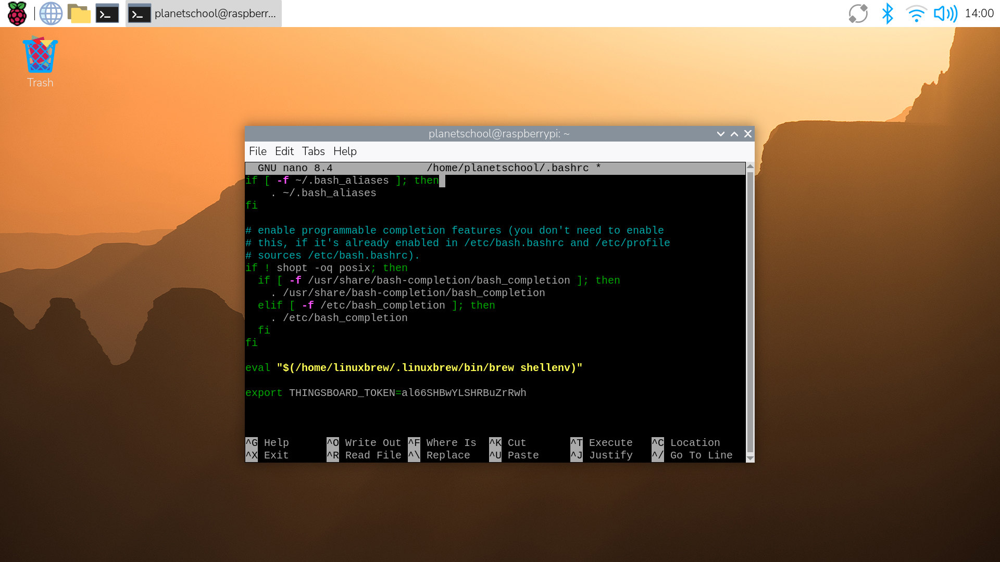

# Getting Your First Sensor Working

In the last section, you successfully grabbed humidity data from the BME280 sensor. Well done! Now we want to send that data from the Raspberry Pi to a publicly viewable dashboard. We are going to be using the service Thingsboard for this. They offer a "forever free" account that supports up to five devices, five dashboards, and sending 1 million packets of data per month, which should be more than enough for this project. You can open your account [here](https://thingsboard.cloud/signup)

Once you have your account, log in and create a new device. You can find "Devices" in the left navigation panel under "Entities." Your device list will be empty, so click "+ Add device" and name it whatever you like. In the screenshot below, we already have several devices added already from our student projects. 



You may have to also create a device profile—just fill in the minimum required, like the profile name, and leave everything else alone. Then click "Add" and you should see your device in the list. Now, click on your device and click "Copy Access Token". 



Go to your code and create a new section called `## Dashboard` with a variable named `THINGSBOARD_TOKEN` and paste your access token into this variable. Your code should now look like this:

```python
## Import Libraries
import board
from adafruit_bme280 import basic as adafruit_bme280

## Declare Variables
i2c_port = 1  #This is a Raspberry Pi setting
bme280_address = 0x77  #The address of our sensor
i2c = board.I2C()  #Accessing the I2C library
bme280 = adafruit_bme280.Adafruit_BME280_I2C(i2c, int(bme280_address)) #Accessing the BME280 library and connect to sensor via I2C

## Dashboard
THINGSBOARD_TOKEN = “al66SHBwYLSHRBuZrRwh” #This is my fake token

## The Code!
humidity = bme280.humidity  #Get humidity from the sensor
print(humidity)
```

## Store Your Secret Token Locally

🚨 We have a problem 🚨

If you were to save your code file publicly (like Github), then you would now be putting the secret password to your Thingsboard dashboard out into the world. This is bad security practice. Instead, we want to store your secret token on your Raspberry Pi and then have our code grab that token. That way, the token itself is never in the code. To do that, we are going to edit a file on the Raspberry Pi. Open up Terminal and type the following command on a single line:

```bash
sudo nano ~/.bashrc
```

Once you type this, your Terminal will open a document called ".bashrc". Use the down arrow on your keyboard to scroll all the way to the bottom of this document. After the very last line, add: 

```bash
THINGSBOARD_TOKEN = “al66SHBwYLSHRBuZrRwh”
```



Be sure to replace my fake token above with your actual token. To save, hit CTRL+X on your keyboard and type "Y" when asked if you want to save your changes. Now we can replace the token in your code with a command to grab the variable `THINGSBOARD_TOKEN` from the Raspberry Pi operating system. We will need to import a library called `os` in order to do this, so notice the two changes to your code below:

```python
## Import Libraries
import board
from adafruit_bme280 import basic as adafruit_bme280
import os

## Declare Variables
i2c_port = 1  #This is a Raspberry Pi setting
bme280_address = 0x77  #The address of our sensor
i2c = board.I2C()  #Accessing the I2C library
bme280 = adafruit_bme280.Adafruit_BME280_I2C(i2c, int(bme280_address)) #Accessing the BME280 library and connect to sensor via I2C

## Dashboard
THINGSBOARD_TOKEN = os.environ.get("THINGSBOARD_TOKEN")

## The Code!
humidity = bme280.humidity  #Get humidity from the sensor
print(humidity)
```