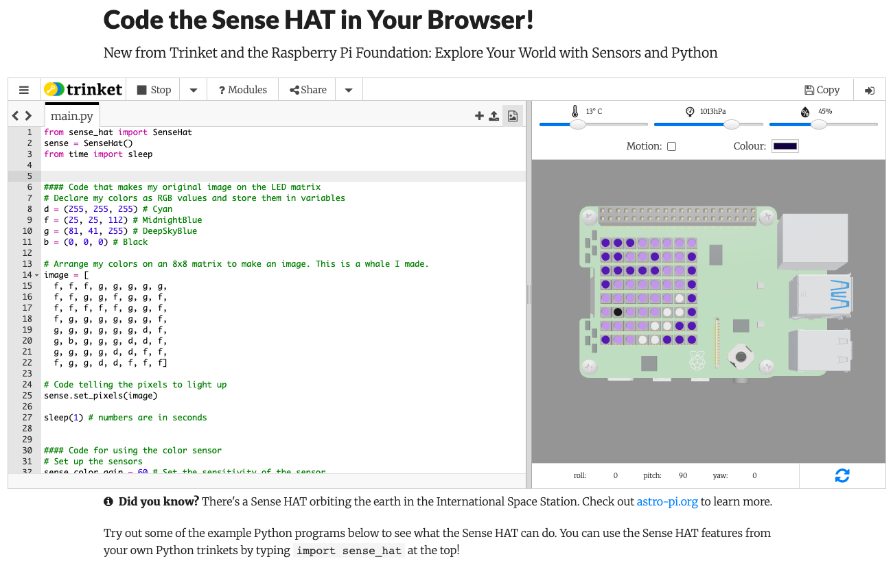

Your project will set the background color of an image to the color that Ocean Pi detects aboard *Wonder*. This will make the ship more colorful below deck for the sailors on board. Your code will use the color luminosity sensor on the Ocean Pi computer’s Sense HAT to make this happen.

This project gratefully borrows from the Astro Pi “Mission Zero” project, which was created under a Creative Commons license. This project shares that license. You can refer to that project as you go, but we have made a few useful edits:
1. We use the Trinket emulator instead of the Astro Pi emulator. The Astro Pi emulator requires you to be a registered Mission Zero participant, which restricts participation to youth under 19 years of age who live in European Space Agency nations. So you cannot save your work. Just like the ocean itself, Ocean Pi is open to anyone, so we wanted a way for anyone to participate and, crucially, be able to save your progress.

2. If you want an extra challenge, you can add on code to make your image move in response to the ship’s movement. This is an optional extension.

#   You will need

You will use a Sense HAT emulator in a web browser to create your program. **You do not need a Raspberry Pi computer or a Sense HAT.** 

If you have a Raspberry Pi computer with a Sense HAT, then you should use that so you can see the LED matrix light up and observe the color sensor changing the light color in real time. Just make sure you have a Sense HAT v. 2.0 because the first version of a Sense HAT does not have a color sensor.

You can find the color sensor above the joystick and slightly to the right labeled “COLOUR.”

#   You will learn
You will learn about the Ocean Pi computer and how to control it, including how to:

* Create color variables to use in your image
* Design and display a pixel art image on the Sense HAT
* Sense the color of light on board Wonder

#   Let’s get started
You will be using Trinket* for writing your code. Trinket has developed a Sense HAT emulator that allows you to change the color that the Sense HAT is seeing, move it around to activate its motion sensors, and manipulate the temperature and humidity.

You can see a demo of the Sense HAT emulator [here](https://trinket.io/sense-hat). In order to save your work, you will need to create a free Trinket account, which you can do [here](https://trinket.io/signup).

**We are aware that Trinket is shutting down in August 2026. We are searching for an alternative but, for now, Trinket is still a great platform for Ocean Pi.*
