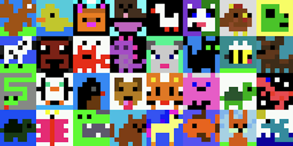

# Using the LED Array

The Sense HAT is an add-on board for the Raspberry Pi that includes an 8x8 LED matrix, perfect for displaying simple images and animations. By the end of this lesson, you will be able to create your own custom pixel art designs and bring them to life on the Sense HAT.

We will start by understanding the basics of pixel art and how it translates to code. You will learn how to create a grid structure that represents the LED matrix on the Sense HAT, and how to assign colors to individual pixels within this grid. We will then explore different coding techniques to translate your pixel art designs into code that can be run on the Sense HAT, allowing you to see your creations come to life in the physical world.

The first and arguably the most important step of this project is to design your creature. In this example, we have designed a whale. Since you only have an 8x8 pixel “screen” on which to design your creature, you will need to be creative. It can be hard to visualize what an array of letters translates to in terms of an LED array, so if you do not have a Sense HAT and Raspberry Pi setup handy, then this is where the Trinket emulator can be very useful. We have customized this link to be useful for creature design.

Here is the code for our whale, which is the creature we will use throughout this tutorial. See if you can follow along with what is happening in this code snippet, even if the exact syntax doesn’t fully make sense. The code is explained below.

```
# Libraries
from sense_hat import SenseHAT
my_sense_hat = SenseHAT()

d = (255, 255, 255)
f = (25, 25, 112) 
g = (0, 191, 255) 
b = (0, 0, 0) 

image = [
  f, f, f, g, g, g, g, g,
  f, f, g, g, f, g, g, f,
  f, f, f, f, f, f, g, g,
  f, g, g, g, g, g, g, g,
  g, g, g, g, g, g, d, d,
  g, b, g, g, g, d, d, f,
  g, g, g, g, d, d, f, f,
  f, g, g, d, d, f, f, f]


my_sense_hat.set_pixels(image)
```

Let’s go line by line through what is happening in this code.

## Libraries and instances

In the first line, we are importing: bringing in code written by someone else so that we can use it in our code. The Sense HAT device has specific Python commands that have been programmed by the folks at the Raspberry Pi Foundation to work with the Sense HAT’s various sensors and its LED array. If we did not import this, we would have to write all of this ourselves within this program.

Next, we create a variable called `my_sense_hat` and turn it into an instance of the Sense HAT() class. When we create a variable named `my_sense_hat`, we could turn it into anything: a number, a string of characters, or we could turn it into an instance of this Sense HAT() thing we have imported and, suddenly, it inherits all of the characteristics of what it means to be a Sense HAT (which is defined by the code we imported). If we had made `my_sense_hat` into a number, it would inherit number characteristics: we could add to it, divide it, etc. Since we made it into an instance of a Sense HAT(), we are going to do some Sense HAT() things with it. If you consider the entire library of code that we imported, it is all for an object called a Sense HAT and it can perform all these cool tasks with sensors and LED lights. When we refer to creating an “instance,” we mean this specific individual. Using the metaphor of numbers again, if we declared `my_sense_hat = 7` instead of `my_sense_hat =  SenseHAT()` the number 7 is the instance of the category of numbers. We can talk about all these number methods like dividing and multiplying, but they are all theoretical until we have an actual number to work with. Once we have the number 7, we can actually divide and multiply it. Same with Sense HAT(). We need to actually create one of these things in order to start using it and changing the LEDs on *this* Sense HAT or getting the color reading from *this* Sense HAT. The instance we have created in this code is called `my_sense_hat`. For the record, you can name this instance whatever you want. After all, it's your Sense HAT. Instead of `my_sense_hat,` you could name it `meerkat_the_sensehat` if you want. 

## Colors

The next four lines of code are defining some colors using the RGB model, which stands for “Red, Green, Blue.” Each value corresponds to the amount of those respective primary colors in the color you are trying to create. Each R, G, or B value can go up to 255. When you include 0, this allows for 256 values in each position. With this many values, you can create 16,777,216 unique colors. You can name these colors whatever you like, but as you will see shortly, it can be helpful to name them a single letter as you design your creature.

## Image design

Finally we get to our actual design. Here we create another variable named `image` (again, the name is up to you) and turn it into an array. This array has 64 values in it representing the 64 LEDs in our 8x8 LED array. The code does not care if we break this into eight different lines of code like we have done above--it could read it as one long line of 64 letters. But it is easier for us to see the design if we separate it visually into 8 lines of code. Here is where giving your colors single letter variable names comes in handy in viewing our design. It’s already pretty challenging to see a whale in this sea of letters, but imagine how much harder it would be with words!

Need some inspiration? [Here are some creature designs](https://trinket.io/python/25c6c552b5) created by us and the folks at the Raspberry Pi Foundation. Feel free to copy/paste this code into your own project as a starting point.



## Light it up

Lastly, we use one of the methods from the `SenseHAT()` class to light up the LEDs with the colors we have defined and in the pattern we have named `image`. 

:::danger[Watch out]

Unlike our variable names, you must type methods *exactly* as they are written: you must write `.set_pixels` in lowercase with the underscore. This is because we are using commands defined by someone else: the library of code we imported earlier.

:::

You are now ready to start designing your creature! 