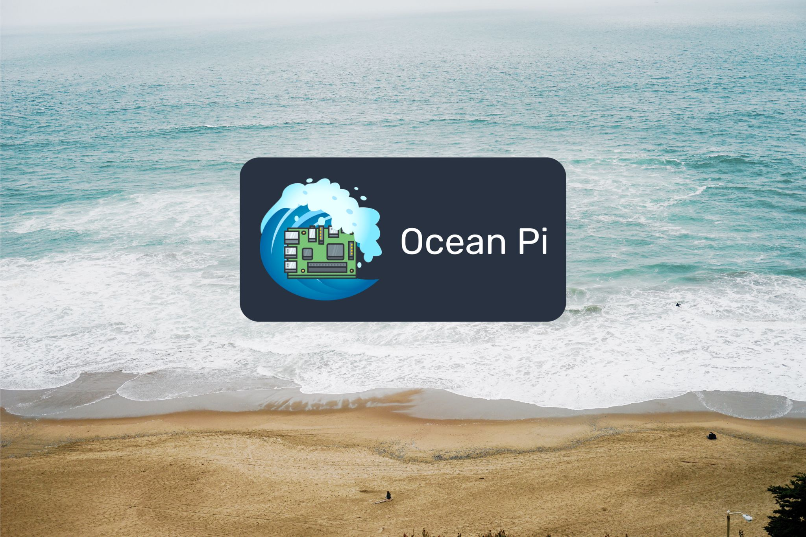

# Welcome to Ocean Pi Projects

The ocean is vast, dynamic, and still largely unknown — and it needs the next generation of explorers to understand and protect it. Ocean Pi is a call to aspiring oceanographers, marine biologists, engineers, and problem-solvers who want to do more than study the ocean from shore. Through open-source hardware and real-world deployments aboard The Voyaging Institute's two research schooners *Wonder* and *Jolly II Rover*, you’ll help design and build the tools that monitor water quality, weather, motion, and marine life in real time. Every voyage presents new challenges — intermittent connectivity, harsh saltwater environments, power constraints, sensor calibration, live video streaming at sea — and every challenge becomes an opportunity to innovate. 

Whether you dream of studying coral reefs, tracking plankton blooms, measuring ocean chemistry, or engineering resilient field systems, this is your invitation to help expand how we observe and understand the world’s oceans — and to build the technology that makes that discovery possible.

Ocean Pi is also an excellent way to learn Python or put your existing Python skills to good use. We have projects for the beginner up to the advanced coder.